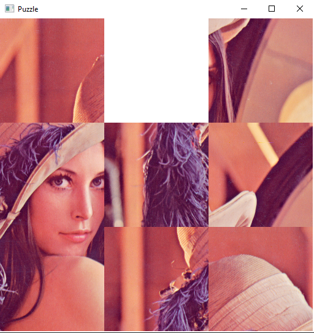
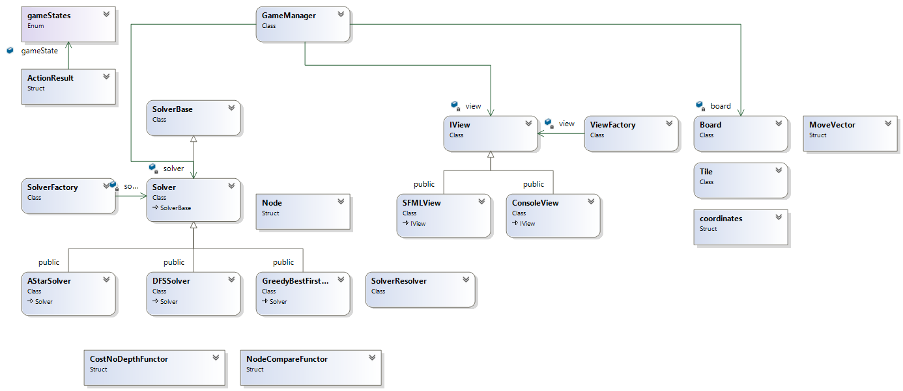

# Puzzle
Puzzle game in C++ implemented with three solver algorithms

Sliding puzzle implemented with SFML library and three solving algorithms: Depth first search, A* and Greedy best first.
This implementation was part of my software engeering program for Advanced C++ course.

Class diagram for this project:

